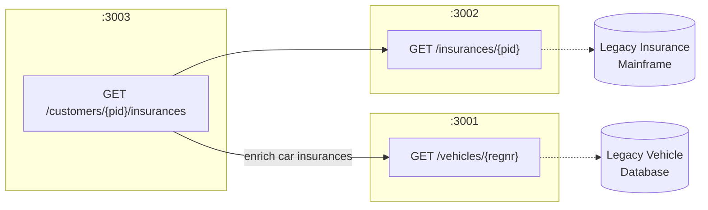

# ThreadPilot Insurance Platform

A service-oriented insurance platform demonstrating architecture patterns, integration design, and clean API design.

## Architecture Overview

ThreadPilot consists of three microservices:

- **Customer Service** (port 3003) — orchestrator that aggregates data from other services
- **Insurance Service** (port 3002) — anti-corruption layer around the legacy insurance mainframe
- **Vehicle Service** (port 3001) — anti-corruption layer around the legacy vehicle database



### Design Rationale

| Pattern | Purpose |
|---------|---------|
| **Anti-corruption layer** | Insurance and Vehicle services isolate legacy systems, translating their data into a clean domain model |
| **Orchestration** | Customer service composes data from multiple sources, keeping integration logic centralized |
| **Service separation** | Each service owns its domain, enabling independent deployment and scaling |

## APIs

### Vehicle API (port 3001)

| Endpoint | Method | Description |
|----------|--------|-------------|
| `/vehicles/{regnr}` | GET | Get vehicle by registration number |

### Insurance API (port 3002)

| Endpoint | Method | Description |
|----------|--------|-------------|
| `/insurances/{pid}` | GET | Get insurance policies by personal ID |

### Customer API (port 3003)

| Endpoint | Method | Description |
|----------|--------|-------------|
| `/customers/{pid}/insurances` | GET | Get customer insurances with vehicle details |

## Data Models

### Insurance

| Field | Type | Required | Description |
|-------|------|----------|-------------|
| `id` | uuid | Yes | Unique identifier |
| `pid` | string | Yes | Personal identification number |
| `type` | enum | Yes | `Car`, `Pet`, or `Health` |
| `status` | string | Yes | Policy status |
| `premium` | number | Yes | Monthly premium in USD |

### CustomerInsurance

Extends Insurance with vehicle details for car policies.

| Field | Type | Required | Description |
|-------|------|----------|-------------|
| *(all Insurance fields)* | | | |
| `vehicle` | Vehicle | No | Vehicle details (only for Car insurance) |

### Vehicle

| Field | Type | Required |
|-------|------|----------|
| `vin` | string | Yes |
| `regnr` | string | Yes |
| `make` | string | Yes |
| `model` | string | Yes |
| `year` | integer | Yes |

### Insurance Pricing

| Type | Monthly Premium |
|------|-----------------|
| Pet | $10 |
| Health | $20 |
| Car | $30 |

## Running Locally

### Prerequisites

- Node.js 18+
- npm

### Start Services

```bash
# Install dependencies
npm install

# Start all services
npm run dev

# Or start individually
npm run dev:vehicle   # Port 3001
npm run dev:insurance # Port 3002
npm run dev:customer  # Port 3003
```

### Run Tests

```bash
npm test
```

## Error Handling

The APIs use standard HTTP status codes and consistent error responses:

| Status | Meaning |
|--------|---------|
| 200 | Success |
| 400 | Invalid input (malformed PID, registration number) |
| 404 | Resource not found |
| 500 | Internal server error |

### Error Response Format

```json
{
  "error": "Not found",
  "message": "No vehicle found with registration ABC123"
}
```

### Graceful Degradation

When the Customer API cannot reach the Vehicle service, it returns insurance data without vehicle enrichment rather than failing entirely. This ensures partial availability.

## Extensibility

The architecture supports future growth:

- **New insurance types** — add to the `type` enum and implement any type-specific enrichment
- **Additional data sources** — add new services behind the Customer orchestrator
- **API versioning** — version via URL prefix (`/v1/`, `/v2/`) when breaking changes are needed
- **Real-time vehicle data** — Vehicle service abstraction allows swapping the legacy DB for a live API

## Security Considerations

- **PID handling** — Personal identification numbers are sensitive; in production, implement field-level encryption and audit logging
- **Service-to-service auth** — Use mutual TLS or API keys between internal services
- **Input validation** — All path parameters are validated before use
- **Rate limiting** — Recommended for production to prevent abuse

## API Specifications

OpenAPI 3.1.0 specs in `/docs/api/`:

- `vehicle-openapi.yaml`
- `insurance-openapi.yaml`
- `customer-openapi.yaml`

## Personal Reflection

<!-- TODO: Peter to fill in -->

*[Your 3-5 sentence reflection on similar experiences, challenges, and what you'd extend with more time]*
