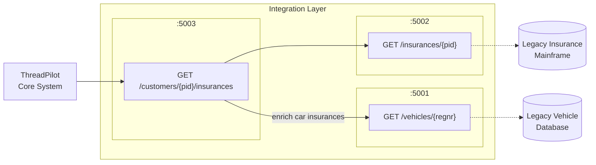

# Insurance Integration Layer

An integration layer connecting **ThreadPilot** (a new core insurance system) to legacy backend systems. Built with .NET 8 and ASP.NET Core, demonstrating anti-corruption layers, service orchestration, and clean API design.

## Architecture Overview

This integration layer consists of three microservices that abstract legacy systems and provide a unified API for ThreadPilot:

- **Customer Service** (port 5003) — orchestrator that aggregates data from other services
- **Insurance Service** (port 5002) — anti-corruption layer around the legacy insurance mainframe
- **Vehicle Service** (port 5001) — anti-corruption layer around the legacy vehicle database



### Design Rationale

| Pattern | Purpose |
|---------|---------|
| **Anti-corruption layer** | Insurance and Vehicle services isolate legacy systems, translating their data into a clean domain model |
| **Orchestration** | Customer service composes data from multiple sources, keeping integration logic centralized |
| **Service separation** | Each service owns its domain, enabling independent deployment and scaling |

## Legacy System Simulators

The `legacy/` folder contains mock implementations of the backend systems that the integration layer connects to. These simulators provide realistic test data without requiring actual legacy infrastructure.

### VehicleDatabase (port 5101)

Simulates the legacy vehicle registration database.

| Endpoint | Method | Description |
|----------|--------|-------------|
| `/vehicles/{regnr}` | GET | Get vehicle by registration number |

**Mock data:**

| Regnr | VIN | Make | Model | Year |
|-------|-----|------|-------|------|
| ABC123 | WBA3A5C55DF123456 | BMW | 320i | 2019 |
| XYZ789 | YV1CZ91H841234567 | Volvo | XC60 | 2021 |
| DEF456 | WVWZZZ3CZWE123456 | Volkswagen | Golf | 2020 |

### InsuranceMainframe (port 5102)

Simulates the legacy insurance policy mainframe.

| Endpoint | Method | Description |
|----------|--------|-------------|
| `/policies/{pid}` | GET | Get policies by personal ID |

**Mock data:**

| PID | Policies |
|-----|----------|
| 199001011234 | Car (ABC123), Pet, Health |
| 198505152345 | Car (XYZ789) |
| 197212123456 | Pet, Health |

## APIs

### Vehicle API (port 5001)

| Endpoint | Method | Description |
|----------|--------|-------------|
| `/vehicles/{regnr}` | GET | Get vehicle by registration number |
| `/health` | GET | Health check |

### Insurance API (port 5002)

| Endpoint | Method | Description |
|----------|--------|-------------|
| `/insurances/{pid}` | GET | Get insurance policies by personal ID |
| `/health` | GET | Health check |

**Example response:**

```json
[
  {
    "id": "3fa85f64-5717-4562-b3fc-2c963f66afa6",
    "pid": "199001011234",
    "type": "Car",
    "status": "Active",
    "premium": 30.00,
    "regnr": "ABC123"
  },
  {
    "id": "4fa85f64-5717-4562-b3fc-2c963f66afa7",
    "pid": "199001011234",
    "type": "Pet",
    "status": "Active",
    "premium": 10.00,
    "regnr": null
  }
]
```

### Customer API (port 5003)

| Endpoint | Method | Description |
|----------|--------|-------------|
| `/customers/{pid}/insurances` | GET | Get customer insurances with vehicle details |
| `/health` | GET | Health check |

**Example response:**

```json
[
  {
    "id": "3fa85f64-5717-4562-b3fc-2c963f66afa6",
    "pid": "199001011234",
    "type": "Car",
    "status": "Active",
    "premium": 30.00,
    "vehicle": {
      "vin": "WBA3A5C55DF123456",
      "regnr": "ABC123",
      "make": "BMW",
      "model": "320i",
      "year": 2019
    }
  },
  {
    "id": "4fa85f64-5717-4562-b3fc-2c963f66afa7",
    "pid": "199001011234",
    "type": "Pet",
    "status": "Active",
    "premium": 10.00,
    "vehicle": null
  }
]
```

## Data Models

### Insurance

| Field | Type | Required | Description |
|-------|------|----------|-------------|
| `id` | Guid | Yes | Unique identifier |
| `pid` | string | Yes | Personal identification number |
| `type` | enum | Yes | `Car`, `Pet`, or `Health` |
| `status` | string | Yes | Policy status |
| `premium` | decimal | Yes | Monthly premium in USD |
| `regnr` | string | No | Vehicle registration number (only for Car insurance) |

### CustomerInsurance

Extends Insurance with vehicle details for car policies.

| Field | Type | Required | Description |
|-------|------|----------|-------------|
| *(all Insurance fields)* | | | |
| `vehicle` | Vehicle | No | Vehicle details (only for Car insurance) |

### Vehicle

| Field | Type | Required |
|-------|------|----------|
| `vin` | string | Yes |
| `regnr` | string | Yes |
| `make` | string | Yes |
| `model` | string | Yes |
| `year` | int | Yes |

### Insurance Pricing

| Type | Monthly Premium |
|------|-----------------|
| Pet | $10 |
| Health | $20 |
| Car | $30 |

## Running Locally

### Prerequisites

- [.NET 8 SDK](https://dotnet.microsoft.com/download/dotnet/8.0)

### Start Legacy Simulators

```bash
# Start legacy backends (each in separate terminal)
dotnet run --project legacy/VehicleDatabase      # Port 5101
dotnet run --project legacy/InsuranceMainframe   # Port 5102
```

### Start Integration Services

```bash
# Restore dependencies
dotnet restore

# Start integration layer services (each in separate terminal)
dotnet run --project src/VehicleService     # Port 5001
dotnet run --project src/InsuranceService   # Port 5002
dotnet run --project src/CustomerService    # Port 5003
```

### Run Tests

```bash
dotnet test
```

Currently 28 tests across:
- `VehicleService.Tests` (6 tests)
- `InsuranceService.Tests` (9 tests)
- `CustomerService.Tests` (13 tests)

## Error Handling

The APIs use standard HTTP status codes and consistent error responses:

| Status | Meaning |
|--------|---------|
| 200 | Success |
| 400 | Invalid input (malformed PID, registration number) |
| 404 | Resource not found |
| 500 | Internal server error |
| 503 | Legacy service unavailable |
| 504 | Legacy service timeout |

### Error Response Format

```json
{
  "error": "Not found",
  "message": "No vehicle found with registration ABC123"
}
```

### Graceful Degradation

When the Customer API cannot reach the Vehicle service, it returns insurance data without vehicle enrichment rather than failing entirely. This ensures partial availability.

## Extensibility

The architecture supports future growth:

- **New insurance types** — add to the `InsuranceType` enum and implement any type-specific enrichment
- **Additional data sources** — inject new service clients via dependency injection
- **API versioning** — use ASP.NET Core API versioning (`/v1/`, `/v2/`) when breaking changes are needed
- **Real-time vehicle data** — Vehicle service abstraction allows swapping the legacy DB for a live API

## Security Considerations

- **PID handling** — Personal identification numbers are sensitive; in production, implement field-level encryption and audit logging
- **Service-to-service auth** — Use mutual TLS or API keys between internal services
- **Input validation** — All path parameters are validated using data annotations and model binding
- **Rate limiting** — Use ASP.NET Core rate limiting middleware in production

## API Specifications

OpenAPI 3.1.0 specs in `/docs/api/`:

- `vehicle-openapi.yaml`
- `insurance-openapi.yaml`
- `customer-openapi.yaml`

## Personal Reflection

<!-- TODO: Peter to fill in -->

*[Your 3-5 sentence reflection on similar experiences, challenges, and what you'd extend with more time]*
