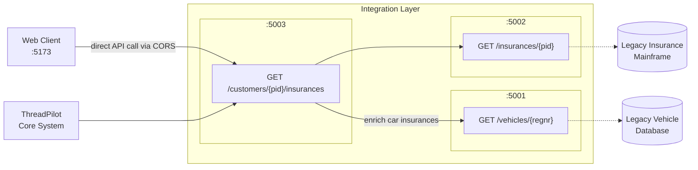

# Insurance Integration Layer

An integration layer connecting **ThreadPilot** (a new core insurance system) to legacy backend systems. Built with .NET 8 and ASP.NET Core, demonstrating anti-corruption layers, service orchestration, and clean API design.

## Architecture Overview

This integration layer consists of three microservices that abstract legacy systems and provide a unified API for ThreadPilot:

- **Customer Service** (port 5003) — orchestrator that aggregates data from other services
- **Insurance Service** (port 5002) — anti-corruption layer around the legacy insurance mainframe
- **Vehicle Service** (port 5001) — anti-corruption layer around the legacy vehicle database



### Design Rationale

| Pattern | Purpose |
|---------|---------|
| **Anti-corruption layer** | Insurance and Vehicle services isolate legacy systems, translating their data into a clean domain model |
| **Orchestration** | Customer service composes data from multiple sources, keeping integration logic centralized |
| **Service separation** | Each service owns its domain, enabling independent deployment and scaling |

## Legacy System Simulators

The `legacy/` folder contains mock implementations of the backend systems that the integration layer connects to. These simulators provide realistic test data without requiring actual legacy infrastructure.

### VehicleDatabase (port 5101)

Simulates the legacy vehicle registration database.

| Endpoint | Method | Description |
|----------|--------|-------------|
| `/vehicles/{regnr}` | GET | Get vehicle by registration number |

**Mock data:**

| Regnr | VIN | Make | Model | Year |
|-------|-----|------|-------|------|
| ABC123 | WBA3A5C55DF123456 | BMW | 320i | 2019 |
| XYZ789 | YV1CZ91H841234567 | Volvo | XC60 | 2021 |
| DEF456 | WVWZZZ3CZWE123456 | Volkswagen | Golf | 2020 |

### InsuranceMainframe (port 5102)

Simulates the legacy insurance policy mainframe.

| Endpoint | Method | Description |
|----------|--------|-------------|
| `/policies/{pid}` | GET | Get policies by personal ID |

**Mock data:**

| PID | Policies |
|-----|----------|
| 199001011234 | Car (ABC123), Pet, Health |
| 198505152345 | Car (XYZ789) |
| 197212123456 | Pet, Health |

## APIs

### Vehicle API (port 5001)

| Endpoint | Method | Description |
|----------|--------|-------------|
| `/vehicles/{regnr}` | GET | Get vehicle by registration number |
| `/health` | GET | Health check |

### Insurance API (port 5002)

| Endpoint | Method | Description |
|----------|--------|-------------|
| `/insurances/{pid}` | GET | Get insurance policies by personal ID |
| `/health` | GET | Health check |

**Example response:**

```json
[
  {
    "id": "3fa85f64-5717-4562-b3fc-2c963f66afa6",
    "pid": "199001011234",
    "type": "Car",
    "status": "Active",
    "premium": 30.00,
    "regnr": "ABC123"
  },
  {
    "id": "4fa85f64-5717-4562-b3fc-2c963f66afa7",
    "pid": "199001011234",
    "type": "Pet",
    "status": "Active",
    "premium": 10.00,
    "regnr": null
  }
]
```

### Customer API (port 5003)

| Endpoint | Method | Description |
|----------|--------|-------------|
| `/customers/{pid}/insurances` | GET | Get customer insurances with vehicle details |
| `/health` | GET | Health check |

**Example response:**

```json
[
  {
    "id": "3fa85f64-5717-4562-b3fc-2c963f66afa6",
    "pid": "199001011234",
    "type": "Car",
    "status": "Active",
    "premium": 30.00,
    "vehicle": {
      "vin": "WBA3A5C55DF123456",
      "regnr": "ABC123",
      "make": "BMW",
      "model": "320i",
      "year": 2019
    }
  },
  {
    "id": "4fa85f64-5717-4562-b3fc-2c963f66afa7",
    "pid": "199001011234",
    "type": "Pet",
    "status": "Active",
    "premium": 10.00,
    "vehicle": null
  }
]
```

## Data Models

### Insurance

| Field | Type | Required | Description |
|-------|------|----------|-------------|
| `id` | Guid | Yes | Unique identifier |
| `pid` | string | Yes | Personal identification number |
| `type` | enum | Yes | `Car`, `Pet`, or `Health` |
| `status` | string | Yes | Policy status |
| `premium` | decimal | Yes | Monthly premium in USD |
| `regnr` | string | No | Vehicle registration number (only for Car insurance) |

### CustomerInsurance

Extends Insurance with vehicle details for car policies.

| Field | Type | Required | Description |
|-------|------|----------|-------------|
| *(all Insurance fields)* | | | |
| `vehicle` | Vehicle | No | Vehicle details (only for Car insurance) |

### Vehicle

| Field | Type | Required |
|-------|------|----------|
| `vin` | string | Yes |
| `regnr` | string | Yes |
| `make` | string | Yes |
| `model` | string | Yes |
| `year` | int | Yes |

### Insurance Pricing

| Type | Monthly Premium |
|------|-----------------|
| Pet | $10 |
| Health | $20 |
| Car | $30 |

## Web Client

The `client/` directory contains a React/TypeScript frontend for customer insurance lookup.

### Features

- Search customer insurance policies by Swedish personal number (personnummer)
- Display policy details including type, status, and monthly premium
- Show vehicle information for car insurance policies
- Policy summary with total premium calculation
- Test customers info box with available demo personal numbers
- Responsive design (mobile-first, 2-column grid on desktop)
- Professional insurance/fintech styling with rounded corners and shadows

### Tech Stack

- React 19 with TypeScript 5.9
- Vite 7 for build tooling
- Tailwind CSS v4 for styling
- Lucide React for icons (Car, PawPrint, Heart, Shield, etc.)
- ESLint 9 for code quality

### Configuration

The web client uses runtime configuration to locate the Customer Service API:

- **Development**: Uses `VITE_API_BASE_URL` environment variable (defaults to empty string for same-origin)
- **Production**: Fetches `/config.json` at startup, which is generated from a template using `envsubst`

Key files:
- `client/src/config.ts` - Runtime config loader
- `client/config.template.json` - Template for runtime config (uses `${API_BASE_URL}` placeholder)

### Running the Client

```bash
cd client
npm install
npm run dev    # Development server on port 5173
```

The client calls the Customer Service API directly via CORS. In development, configure `VITE_API_BASE_URL` if needed.

## Services

The `src/` directory contains three .NET microservices that form the integration layer.

### Tech Stack

- .NET 8 with ASP.NET Core
- Minimal APIs (endpoint routing, not controllers)
- C# records for immutable domain models
- Typed HttpClients via dependency injection
- xUnit and Moq for testing

## Running Locally

### Prerequisites

- [.NET 8 SDK](https://dotnet.microsoft.com/download/dotnet/8.0)
- [Node.js 20+](https://nodejs.org/) (for web client)

### Start Legacy Simulators

```bash
# Start legacy backends (each in separate terminal)
dotnet run --project legacy/VehicleDatabase      # Port 5101
dotnet run --project legacy/InsuranceMainframe   # Port 5102
```

### Start Integration Services

```bash
# Restore dependencies
dotnet restore

# Start integration layer services (each in separate terminal)
dotnet run --project src/VehicleService     # Port 5001
dotnet run --project src/InsuranceService   # Port 5002
dotnet run --project src/CustomerService    # Port 5003
```

### Run Tests

```bash
dotnet test
```

Currently 28 tests across:
- `VehicleService.Tests` (6 tests)
- `InsuranceService.Tests` (9 tests)
- `CustomerService.Tests` (13 tests)

## Error Handling

The APIs use standard HTTP status codes and consistent error responses:

| Status | Meaning |
|--------|---------|
| 200 | Success |
| 400 | Invalid input (malformed PID, registration number) |
| 404 | Resource not found |
| 500 | Internal server error |
| 503 | Legacy service unavailable |
| 504 | Legacy service timeout |

### Error Response Format

```json
{
  "error": "Not found",
  "message": "No vehicle found with registration ABC123"
}
```

### Graceful Degradation

When the Customer API cannot reach the Vehicle service, it returns insurance data without vehicle enrichment rather than failing entirely. This ensures partial availability.

## Extensibility

The architecture supports future growth:

- **New insurance types** — add to the `InsuranceType` enum and implement any type-specific enrichment
- **Additional data sources** — inject new service clients via dependency injection
- **API versioning** — use ASP.NET Core API versioning (`/v1/`, `/v2/`) when breaking changes are needed
- **Real-time vehicle data** — Vehicle service abstraction allows swapping the legacy DB for a live API

## Security Considerations

- **PID handling** — Personal identification numbers are sensitive; in production, implement field-level encryption and audit logging
- **Service-to-service auth** — Use mutual TLS or API keys between internal services
- **Input validation** — All path parameters are validated using data annotations and model binding
- **Rate limiting** — Use ASP.NET Core rate limiting middleware in production

## CI/CD

GitHub Actions workflows in `.github/workflows/` enable automated build, test, and deployment:

### Workflow Structure

| Workflow | Trigger | Purpose |
|----------|---------|---------|
| `ci-vehicle-service.yml` | Push/PR to `src/VehicleService/**` | Build, test, deploy Vehicle Service |
| `ci-insurance-service.yml` | Push/PR to `src/InsuranceService/**` | Build, test, deploy Insurance Service |
| `ci-customer-service.yml` | Push/PR to `src/CustomerService/**` | Build, test, deploy Customer Service |
| `ci-legacy-vehicle-db.yml` | Push/PR to `legacy/VehicleDatabase/**` | Build, deploy Legacy Vehicle DB |
| `ci-legacy-mainframe.yml` | Push/PR to `legacy/InsuranceMainframe/**` | Build, deploy Legacy Mainframe |
| `ci-web.yml` | Push/PR to `client/**` | Build, lint, deploy Web Client |
| `deploy-all.yml` | Manual | Deploy all services with optional infra |

### Reusable Workflows

- `_build-dotnet.yml` - .NET build, test, and Docker push
- `_build-node.yml` - Node.js build, lint, type-check, and Docker push
- `_deploy-aca.yml` - Deploy to Azure Container Apps

### Required Secrets

| Secret | Description |
|--------|-------------|
| `ACR_LOGIN_SERVER` | Azure Container Registry URL |
| `ACR_USERNAME` | ACR service principal or admin username |
| `ACR_PASSWORD` | ACR service principal or admin password |
| `AZURE_CREDENTIALS` | Azure service principal JSON for deployment |
| `AZURE_RESOURCE_GROUP` | Target resource group for Container Apps |

### Path-Based Triggers

Each service workflow only runs when its source files change, enabling:
- Independent deployment of services
- Faster CI feedback (only affected services are built)
- Reduced resource usage

## Developer Onboarding

### Getting Started

1. Clone the repo and install prerequisites (.NET 8 SDK, Node.js 20+)
2. Run `dotnet restore` to fetch dependencies
3. Start legacy simulators, then integration services (see [Running Locally](#running-locally))
4. Run `dotnet test` to verify everything works

### Project Structure

| Directory | Purpose |
|-----------|---------|
| `src/` | Integration layer services (start here for business logic) |
| `legacy/` | Mock backend simulators (reference implementations) |
| `client/` | React frontend |
| `tests/` | Unit and integration tests (mirrors `src/` structure) |
| `.github/workflows/` | CI/CD pipelines |

### Key Abstractions

Each service follows the same pattern:

- `Clients/I{Legacy}Client.cs` — Interface for legacy system
- `Clients/{Legacy}Client.cs` — Anti-corruption layer implementation
- `Models/` — Domain records (immutable C# records)
- `Program.cs` — Minimal API endpoints and DI setup

### Adding New Features

| Change | Steps |
|--------|-------|
| New insurance type | Add to `InsuranceType` enum, update `InsuranceMainframeClient` translation |
| New enrichment (e.g., property data) | Add client interface + implementation in CustomerService |
| New service | Copy existing service structure, add to solution and docker-compose |

## API Specifications

OpenAPI 3.1.0 specs in `/docs/api/`:

- `vehicle-openapi.yaml`
- `insurance-openapi.yaml`
- `customer-openapi.yaml`

## Personal Reflection

### Similar Projects
I’ve worked on several projects where we built modern REST APIs in front of older core systems, using clear bounded contexts and anti-corruption layers around mainframes and legacy databases. In those solutions we separated “orchestrator” services from domain/legacy wrappers, much like Customer vs. Insurance and Vehicle here. That background made it natural to design this as a small, service-oriented platform rather than a single monolithic API.

### Challenging Aspects
The most challenging part was dealing with the ambiguity in the assignment (especially what ThreadPilot is and how many services it should consist of) and turning that into a coherent, defensible architecture. It was also interesting to decide which responsibilities should live in the Customer service versus the pure legacy wrappers, and to think through error handling and integration behavior in a realistic way. Finally, I had to balance keeping the implementation simple enough for an assignment while still structuring it so it could realistically scale and be extended with new products and rules.

### What I'd Extend with More Time
- Add logging for all services to enable tracability.
- Add security to services (e.g. API keys, OAuth, API Gateway)
- Improve api documentation (e.g. Swagger)
